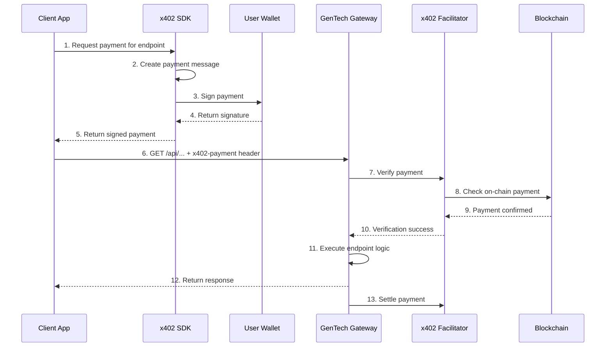

# GenTech x402 Gateway — Usage Examples

**Working code examples for calling GenTech x402 Gateway endpoints with x402 payment verification.**

---

## 📋 Table of Contents

- [Python Examples](#python-examples)
- [JavaScript/Node.js Examples](#javascriptnodejs-examples)
- [cURL Examples](#curl-examples)
- [Payment Flow Diagram](#payment-flow-diagram)
- [Error Handling](#error-handling)

---

## 🐍 Python Examples

### Example 1: Using x402 SDK (Recommended)

First, install the x402 SDK:

```bash
pip install x402
```

Then call a GenTech endpoint:

```python
import asyncio
from x402 import PaymentClient, PaymentType
import httpx

# Configuration
GATEWAY_URL = "https://api.gentechlabs.net"
WALLET_PRIVATE_KEY = "your-wallet-private-key"  # Keep secret!
USDC_ADDRESS = "0x833589fCD6eDb6E08f4c7C32D4f71b54bdA02913"  # USDC on Base

# Initialize x402 payment client
payment_client = PaymentClient(
    private_key=WALLET_PRIVATE_KEY,
    payment_type=PaymentType.EXACT,
    asset_address=USDC_ADDRESS,
    network_id="eip155:8453",  # Base mainnet
    max_fee=1000000  # 1 USDC max fee
)

async def call_endpoint_with_payment(endpoint: str, params: dict = None):
    """Call a GenTech endpoint with x402 payment."""
    resource_url = f"{GATEWAY_URL}{endpoint}"

    # Create x402 payment message
    payment = await payment_client.create_payment(
        resource=resource_url,
        amount=5000,  # $0.005 = 5000 micro-USDC (6 decimals)
    )

    # Sign the payment
    signed_payment = payment_client.sign(payment)

    # Call the endpoint with x402 payment in headers
    headers = {
        "x402-payment": signed_payment,
        "Content-Type": "application/json"
    }

    async with httpx.AsyncClient() as client:
        response = await client.get(
            resource_url,
            headers=headers,
            params=params
        )
        return response.json()

# Example: Game search
async def search_games():
    result = await call_endpoint_with_payment(
        "/api/games/search",
        {"q": "zelda breath of the wild"}
    )
    print("Game search results:")
    print(result)

# Example: Token risk assessment
async def check_token_risk(token_address: str):
    result = await call_endpoint_with_payment(
        "/api/token/risk",
        {
            "address": token_address,
            "chain": "base"
        }
    )
    print(f"Token risk for {token_address}:")
    print(result)

# Example: Wallet analytics
async def analyze_wallet(wallet_address: str):
    result = await call_endpoint_with_payment(
        "/api/wallet/analyze",
        {
            "address": wallet_address,
            "chain": "base"
        }
    )
    print(f"Wallet analytics for {wallet_address}:")
    print(result)

# Example: Airdrop checker
async def check_airdrops(wallet_address: str):
    result = await call_endpoint_with_payment(
        "/api/airdrops/check",
        {"address": wallet_address}
    )
    print(f"Airdrop eligibility for {wallet_address}:")
    print(result)

# Run examples
if __name__ == "__main__":
    asyncio.run(search_games())
    asyncio.run(check_token_risk("0x4200000000000000000000000000000000000042"))
    asyncio.run(analyze_wallet("0x7ebff188f2Eba16518C02864589b1403a5d1296a"))
    asyncio.run(check_airdrops("0x7ebff188f2Eba16518C02864589b1403a5d1296a"))
```

---

### Example 2: Manual x402 Signing (No SDK)

If you prefer to manually sign x402 messages:

```python
import asyncio
import json
import httpx
from web3 import Web3
from eth_account import Account
from eth_account.messages import encode_defunct

# Configuration
GATEWAY_URL = "https://api.gentechlabs.net"
PRIVATE_KEY = "your-wallet-private-key"
ACCOUNT = Account.from_key(PRIVATE_KEY)
ADDRESS = ACCOUNT.address
WEB3 = Web3(Web3.HTTPProvider("https://mainnet.base.org"))

def create_x402_payment(resource_url: str, amount_usd: int):
    """Create x402 payment message manually."""
    payment = {
        "version": 2,
        "scheme": "exact",
        "network": "eip155:8453",
        "asset": "0x833589fCD6eDb6E08f4c7C32D4f71b54bdA02913",
        "payTo": "0x7ebff188f2Eba16518C02864589b1403a5d1296a",
        "amount": amount_usd,  # micro-USDC (6 decimals)
        "resource": resource_url,
        "maxTimeoutSeconds": 300
    }
    return payment

def sign_x402_payment(payment: dict):
    """Sign x402 payment message."""
    message = json.dumps(payment, sort_keys=True)
    message_hash = encode_defunct(text=message)
    signed = ACCOUNT.sign_message(message_hash)
    return signed.signature.hex()

async def call_genetech_endpoint(endpoint: str, amount_usd: int, params: dict = None):
    """Call GenTech endpoint with x402 payment."""
    resource_url = f"{GATEWAY_URL}{endpoint}"

    # Create and sign payment
    payment = create_x402_payment(resource_url, amount_usd)
    signature = sign_x402_payment(payment)

    # Call endpoint
    headers = {
        "x402-payment": json.dumps(payment),
        "x402-signature": signature,
        "Content-Type": "application/json"
    }

    async with httpx.AsyncClient() as client:
        response = await client.get(
            resource_url,
            headers=headers,
            params=params
        )
        return response.json()

# Example: Game search ($0.005 = 5000 micro-USDC)
async def main():
    result = await call_genetech_endpoint(
        "/api/games/search",
        amount_usd=5000,
        params={"q": "elden ring"}
    )
    print(json.dumps(result, indent=2))

if __name__ == "__main__":
    asyncio.run(main())
```

---

### Example 3: Batch Call with Retry

```python
import asyncio
import httpx
from x402 import PaymentClient, PaymentType

class GenTechGateway:
    """GenTech x402 Gateway client."""

    def __init__(self, private_key: str):
        self.gateway_url = "https://api.gentechlabs.net"
        self.client = PaymentClient(
            private_key=private_key,
            payment_type=PaymentType.EXACT,
            asset_address="0x833589fCD6eDb6E08f4c7C32D4f71b54bdA02913",
            network_id="eip155:8453",
            max_fee=1000000
        )

    async def call_endpoint(self, endpoint: str, amount: int, params: dict = None, max_retries: int = 3):
        """Call endpoint with automatic retry on 402."""
        resource_url = f"{self.gateway_url}{endpoint}"

        for attempt in range(max_retries):
            try:
                # Create and sign payment
                payment = await self.client.create_payment(resource_url, amount)
                signed = self.client.sign(payment)

                # Call endpoint
                headers = {
                    "x402-payment": signed,
                    "Content-Type": "application/json"
                }

                async with httpx.AsyncClient() as client:
                    response = await client.get(resource_url, headers=headers, params=params)

                    if response.status_code == 200:
                        return response.json()
                    elif response.status_code == 402:
                        print(f"Payment failed, retrying... (attempt {attempt + 1}/{max_retries})")
                        await asyncio.sleep(1)
                    else:
                        return {"error": f"HTTP {response.status_code}", "details": response.text}

            except Exception as e:
                print(f"Error calling {endpoint}: {e}")
                await asyncio.sleep(1)

        return {"error": "max_retries_exceeded", "endpoint": endpoint}

    async def batch_search(self, queries: list):
        """Batch game search with parallel calls."""
        tasks = [
            self.call_endpoint("/api/games/search", 5000, {"q": q})
            for q in queries
        ]
        return await asyncio.gather(*tasks)

# Example usage
async def main():
    gateway = GenTechGateway("your-wallet-private-key")

    # Batch search
    queries = ["elden ring", "zelda", "starfield", "diablo 4"]
    results = await gateway.batch_search(queries)

    for q, result in zip(queries, results):
        print(f"Results for '{q}':")
        print(json.dumps(result, indent=2))
        print("---")

if __name__ == "__main__":
    asyncio.run(main())
```

---

## 🟢 JavaScript/Node.js Examples

### Example 1: Using x402 SDK

```javascript
import { PaymentClient, PaymentType } from '@x402/sdk';
import axios from 'axios';

// Configuration
const GATEWAY_URL = 'https://api.gentechlabs.net';
const PRIVATE_KEY = 'your-wallet-private-key';
const USDC_ADDRESS = '0x833589fCD6eDb6E08f4c7C32D4f71b54bdA02913';

// Initialize x402 client
const paymentClient = new PaymentClient({
  privateKey: PRIVATE_KEY,
  paymentType: PaymentType.EXACT,
  assetAddress: USDC_ADDRESS,
  networkId: 'eip155:8453', // Base mainnet
  maxFee: 1000000 // 1 USDC max fee
});

async function callEndpointWithPayment(endpoint, params = {}) {
  const resourceUrl = `${GATEWAY_URL}${endpoint}`;

  // Create x402 payment
  const payment = await paymentClient.createPayment({
    resource: resourceUrl,
    amount: 5000 // $0.005 = 5000 micro-USDC
  });

  // Sign payment
  const signedPayment = paymentClient.sign(payment);

  // Call endpoint
  const response = await axios.get(resourceUrl, {
    headers: {
      'x402-payment': signedPayment,
      'Content-Type': 'application/json'
    },
    params
  });

  return response.data;
}

// Example: Game search
async function searchGames(query) {
  const result = await callEndpointWithPayment('/api/games/search', { q: query });
  console.log('Game search results:', result);
  return result;
}

// Example: Token risk assessment
async function checkTokenRisk(tokenAddress, chain = 'base') {
  const result = await callEndpointWithPayment('/api/token/risk', {
    address: tokenAddress,
    chain
  });
  console.log('Token risk:', result);
  return result;
}

// Example: Wallet analytics
async function analyzeWallet(walletAddress, chain = 'base') {
  const result = await callEndpointWithPayment('/api/wallet/analyze', {
    address: walletAddress,
    chain
  });
  console.log('Wallet analytics:', result);
  return result;
}

// Example: Airdrop checker
async function checkAirdrops(walletAddress) {
  const result = await callEndpointWithPayment('/api/airdrops/check', {
    address: walletAddress
  });
  console.log('Airdrop eligibility:', result);
  return result;
}

// Run examples
(async () => {
  await searchGames('zelda breath of the wild');
  await checkTokenRisk('0x4200000000000000000000000000000000000042', 'base');
  await analyzeWallet('0x7ebff188f2Eba16518C02864589b1403a5d1296a', 'base');
  await checkAirdrops('0x7ebff188f2Eba16518C02864589b1403a5d1296a');
})();
```

---

### Example 2: Manual Signing with ethers.js

```javascript
import axios from 'axios';
import { ethers } from 'ethers';

// Configuration
const GATEWAY_URL = 'https://api.gentechlabs.net';
const PRIVATE_KEY = 'your-wallet-private-key';
const wallet = new ethers.Wallet(PRIVATE_KEY);

function createX402Payment(resourceUrl, amountUsd) {
  return {
    version: 2,
    scheme: 'exact',
    network: 'eip155:8453',
    asset: '0x833589fCD6eDb6E08f4c7C32D4f71b54bdA02913',
    payTo: '0x7ebff188f2Eba16518C02864589b1403a5d1296a',
    amount: amountUsd, // micro-USDC (6 decimals)
    resource: resourceUrl,
    maxTimeoutSeconds: 300
  };
}

function signX402Payment(payment) {
  const message = JSON.stringify(payment, Object.keys(payment).sort());
  const messageHash = ethers.hashMessage(message);
  const signature = wallet.signMessage(messageHash);
  return signature;
}

async function callGenetechEndpoint(endpoint, amountUsd, params = {}) {
  const resourceUrl = `${GATEWAY_URL}${endpoint}`;

  // Create and sign payment
  const payment = createX402Payment(resourceUrl, amountUsd);
  const signature = signX402Payment(payment);

  // Call endpoint
  const response = await axios.get(resourceUrl, {
    headers: {
      'x402-payment': JSON.stringify(payment),
      'x402-signature': signature,
      'Content-Type': 'application/json'
    },
    params
  });

  return response.data;
}

// Example: Game search ($0.005 = 5000 micro-USDC)
(async () => {
  const result = await callGenetechEndpoint(
    '/api/games/search',
    5000,
    { q: 'elden ring' }
  );
  console.log(JSON.stringify(result, null, 2));
})();
```

---

### Example 3: React Hook for Frontend

```javascript
import { useState } from 'react';
import axios from 'axios';

const GATEWAY_URL = 'https://api.gentechlabs.net';

export function useGenetechGateway(privateKey) {
  const [loading, setLoading] = useState(false);
  const [error, setError] = useState(null);

  const createX402Payment = (resourceUrl, amountUsd) => ({
    version: 2,
    scheme: 'exact',
    network: 'eip155:8453',
    asset: '0x833589fCD6eDb6E08f4c7C32D4f71b54bdA02913',
    payTo: '0x7ebff188f2Eba16518C02864589b1403a5d1296a',
    amount: amountUsd,
    resource: resourceUrl,
    maxTimeoutSeconds: 300
  });

  const signX402Payment = async (payment) => {
    // Use walletconnect or web3modal for frontend signing
    const provider = window.ethereum;
    const message = JSON.stringify(payment, Object.keys(payment).sort());
    const messageHash = ethers.hashMessage(message);
    const signature = await provider.request({
      method: 'personal_sign',
      params: [messageHash, await provider.getAccounts()]
    });
    return signature;
  };

  const callEndpoint = async (endpoint, amountUsd, params = {}) => {
    setLoading(true);
    setError(null);

    try {
      const resourceUrl = `${GATEWAY_URL}${endpoint}`;
      const payment = createX402Payment(resourceUrl, amountUsd);
      const signature = await signX402Payment(payment);

      const response = await axios.get(resourceUrl, {
        headers: {
          'x402-payment': JSON.stringify(payment),
          'x402-signature': signature,
          'Content-Type': 'application/json'
        },
        params
      });

      return response.data;
    } catch (err) {
      setError(err.message);
      return null;
    } finally {
      setLoading(false);
    }
  };

  return { callEndpoint, loading, error };
}

// Example component
function GameSearch() {
  const { callEndpoint, loading, error } = useGenetechGateway('user-wallet-private-key');
  const [query, setQuery] = useState('');
  const [results, setResults] = useState(null);

  const handleSearch = async () => {
    const data = await callEndpoint('/api/games/search', 5000, { q: query });
    setResults(data);
  };

  return (
    <div>
      <input
        value={query}
        onChange={(e) => setQuery(e.target.value)}
        placeholder="Search games..."
      />
      <button onClick={handleSearch} disabled={loading}>
        {loading ? 'Searching...' : 'Search ($0.005)'}
      </button>
      {error && <p style={{ color: 'red' }}>{error}</p>}
      {results && <pre>{JSON.stringify(results, null, 2)}</pre>}
    </div>
  );
}
```

---

## 📜 cURL Examples

### Example 1: Health Check (Free)

```bash
curl https://api.gentechlabs.net/health
```

### Example 2: Get Pricing (Free)

```bash
curl https://api.gentechlabs.net/pricing
```

### Example 3: Try Paid Endpoint Without Payment (Returns 402)

```bash
curl "https://api.gentechlabs.net/api/games/search?q=zelda"
```

Expected response:
```json
{
  "error": "payment_required",
  "message": "Payment required to access this endpoint"
}
```

### Example 4: With x402 Payment (Advanced)

```bash
# This requires manual x402 signing — use SDK instead
# See Python/JavaScript examples for easier implementation
```

---

## 🔄 Payment Flow Diagram



---

## ❌ Error Handling

### Example: Robust Error Handling (Python)

```python
import asyncio
import httpx
from x402 import PaymentClient, PaymentType

class GenTechGatewayError(Exception):
    """Base error for GenTech Gateway."""
    pass

class PaymentRequiredError(GenTechGatewayError):
    """402 Payment Required."""
    pass

class RateLimitError(GenTechGatewayError):
    """429 Rate Limited."""
    pass

class GenTechGateway:
    def __init__(self, private_key: str):
        self.client = PaymentClient(
            private_key=private_key,
            payment_type=PaymentType.EXACT,
            asset_address="0x833589fCD6eDb6E08f4c7C32D4f71b54bdA02913",
            network_id="eip155:8453",
            max_fee=1000000
        )

    async def call_endpoint(self, endpoint: str, amount: int, params: dict = None):
        """Call endpoint with error handling."""
        resource_url = f"https://api.gentechlabs.net{endpoint}"

        try:
            # Create and sign payment
            payment = await self.client.create_payment(resource_url, amount)
            signed = self.client.sign(payment)

            # Call endpoint
            async with httpx.AsyncClient() as client:
                response = await client.get(
                    resource_url,
                    headers={"x402-payment": signed, "Content-Type": "application/json"},
                    params=params
                )

                # Handle errors
                if response.status_code == 200:
                    return response.json()
                elif response.status_code == 402:
                    raise PaymentRequiredError("Payment required for this endpoint")
                elif response.status_code == 429:
                    raise RateLimitError("Rate limited — please slow down")
                elif response.status_code == 404:
                    raise GenTechGatewayError("Endpoint not found")
                else:
                    raise GenTechGatewayError(f"HTTP {response.status_code}: {response.text}")

        except httpx.RequestError as e:
            raise GenTechGatewayError(f"Network error: {e}")

# Example usage
async def main():
    gateway = GenTechGateway("your-wallet-private-key")

    try:
        result = await gateway.call_endpoint("/api/games/search", 5000, {"q": "zelda"})
        print("Success:", result)
    except PaymentRequiredError as e:
        print("Payment error:", e)
    except RateLimitError as e:
        print("Rate limited:", e)
        await asyncio.sleep(60)  # Wait before retry
    except GenTechGatewayError as e:
        print("Gateway error:", e)

if __name__ == "__main__":
    asyncio.run(main())
```

---

## 💡 Tips

1. **Use Base mainnet** — Lowest gas fees and best performance
2. **Cache responses** — Avoid paying for the same query multiple times
3. **Batch requests** — Use parallel calls for efficiency
4. **Handle 402 gracefully** — Retry with new payment if verification fails
5. **Monitor costs** — Track payment amounts per endpoint
6. **Use testnet for testing** — Mainnet requires real USDC

---

## 📚 More Resources

- [x402 Documentation](https://x402.org)
- [GenTech Gateway OpenAPI Spec](https://api.gentechlabs.net/openapi.json)
- [Getting Started Guide](./GETTING-STARTED.md)

---

**Last Updated:** July 7, 2026
**Version:** 6.0.0